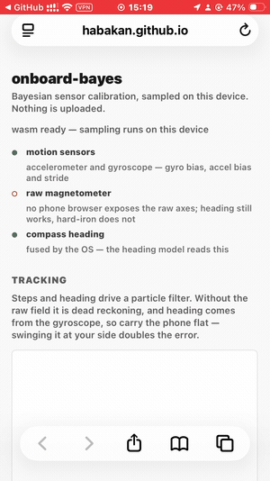

# onboard-bayes

Bayesian calibration of phone sensor data, sampled on the device itself. No server, no
upload, no native numerics code — the model is Stan, and [stanwasm](https://github.com/habakan/stanwasm)
parses, compiles and samples it inside the WebView.

**[Open it on a phone →](https://habakan.github.io/onboard-bayes/)**



Seventeen steps out and back, on an iPhone SE in Safari. Every step is detected from
the accelerometer and every turn integrated from the gyroscope, live. The return leg
does not land on the outbound one — that gap is the drift, and with no raw magnetometer
in a browser there is nothing to correct it.

The question is whether you can process phone sensor data with Bayesian inference
on-device, writing web code only. The answer so far is yes, with three caveats worth
knowing before you start. Every measurement quoted below is in
[FINDINGS.md](FINDINGS.md).

## What runs

| Model | Sensor | Reachable from a WebView |
|---|---|---|
| Gyroscope bias | `devicemotion` rotation rate | yes |
| Accelerometer bias | `devicemotion` acceleration | yes |
| Stride constant | `devicemotion`, hierarchical over walks | yes |
| Heading | `deviceorientation` | yes, already fused |
| Magnetometer hard-iron | `CMMotionManager` | native build only |

No phone browser exposes a raw magnetometer. Chrome for Android has never shipped the
Generic Sensor `Magnetometer` on any version, desktop Chrome keeps it behind
`#enable-generic-sensor-extra-classes`, and Safari does not implement it;
`webkitCompassHeading` gives only a heading the OS has already fused. So the hard-iron
model runs in the native build, behind a ~60-line Capacitor plugin over
`CMMotionManager` — a sensor tap, not arithmetic. The model is still Stan and the
sampling still happens in wasm.

`magnetometer.ts` tries both backends and reports which one answered, so this is checked
on each device rather than assumed. Both permissions are prompted, must be triggered
from a tap, and need a secure context.

Tracking runs a Rao-Blackwellised particle filter on the constants those models
estimate. Given the raw field it localizes against a magnetic map; without one — which
is every browser — it is dead reckoning.

## The three caveats

**Speed is a property of the model, not of the device.** An identified fit lands in
15–88 ms on an iPhone SE, 1.2–1.4x the same code on an M-series laptop. Not the
several-fold penalty worth designing around.

**An unidentified model is slow and wrong at the same time.** Holding the phone still
gives one point on the gravity sphere, so every offset at that distance fits equally
well. NUTS walks that ridge: 8 s to return `bx=-5.5` where the answer is `0.05`. Turning
the phone over a few times makes the same model finish in 64 ms with the right answer —
125x, from data collection alone. Every fit therefore reports its strongest posterior
correlation, because the wrong answers are not noisier, only confident.

**The phone has to be carried flat.** Heading comes from the gyroscope, so the filter
turns with the device, not with the walker. Over five real walks of the same 180 degree
turn, held flat it lands within 13%; swung at your side it comes out double, and no
amount of filtering reaches that — an arm swing rotates the device without turning you.

## Running it

```bash
npm install
npm run dev          # https on the LAN, so a phone can open it
```

Open the printed `https://<lan-ip>:5173` on the phone and accept the self-signed
certificate. Tap a model, follow the capture instruction, and the run appears in the
table with its compile and sample time. **Tracking** walks the filter and flashes a
counter on every detected step; **Stride calibration** fits `k` over several walks;
**Record for replay** saves the raw stream to `recordings/`, so detection settings can
be swept offline with `npm run replay` instead of one walk per parameter.

For the hard-iron model, build the native app instead:

```bash
RECORD_URL=http://<lan-ip>:5173 npm run build && npx cap sync ios && npx cap open ios
```

Pick a signing team in Xcode and run on a device. `CMMotionManager` needs no permission
prompt — unlike `DeviceMotion` in the browser. `RECORD_URL` is where the bundled app
posts recordings; it is editable in the app when that address moves.

```bash
npm run build          # typechecks and produces dist/
npm run verify:rbpf    # the filter's layers against known answers
npm run bench:loc      # localization benchmark
```

## Layout

| File | Role |
|---|---|
| `src/sensors.ts` | Permission flow and capture buffers |
| `src/models.ts` | The Stan programs |
| `src/bench.ts` | One timed fit, and a sweep over N |
| `src/main.ts` | UI |
| `src/rbpf/basis.ts` | Reduced-rank GP basis and its gradients |
| `src/rbpf/map.ts` | One particle's Gaussian over the field |
| `src/rbpf/filter.ts` | Poses, weights, resampling |
| `src/rbpf/pdr.ts` | Step detection and stride length |
| `src/tracking.ts` | Live sensors into the filter, and the path drawing |
| `src/rbpf/replay.mjs` | Replay a recording, sweep detection settings |
| `src/rbpf/disturbance.mjs` | How much a mounting's motors move the field |
| `FINDINGS.md` | Every measurement behind the claims above |

## stanwasm

The inference engine is [stanwasm](https://github.com/habakan/stanwasm): a Rust port of
Stan that parses, compiles and samples a model inside one WebAssembly module, with
nuts-rs as the sampler and no backend behind it. This repository is a demonstration of
it and holds only the models, the capture protocols and the app; the language and
sampler live there.

> habakan. *stanwasm* — Stan inference engine for WebAssembly. Apache-2.0.
> <https://github.com/habakan/stanwasm>

## Requirements

stanwasm 0.3.0. 0.1.1 fixed the relaxed SIMD opcodes WebKit rejects, so anything
earlier fails to instantiate on Safari and on iOS at all; 0.1.2 added the indexed
assignment the stride model needs. Moving to 0.3.0 changes no answer here — all five
models return the same posterior means to five decimal places under the same seed —
and costs 124 KB of wasm.
